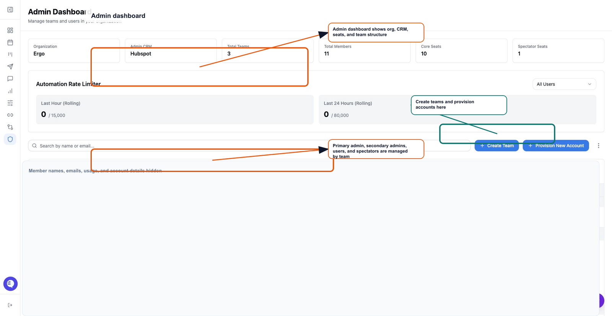

Use this page to understand how Ergo represents your organization before you move members, change roles, or grant access. The Admin dashboard shows the organization, its teams, and each team's primary admin, secondary admins, users, and spectators.

## Who can use this

- Super Admins who manage the full organization structure.
- Team admins who manage or review the teams they own.

## Before you start

- Confirm whether the person is an organization member, a member of one team, or a member of multiple teams.
- Check whether the person is a primary admin, secondary admin, standard user, or spectator.
- Confirm any separate access grants, such as reporting access, global meeting access, and CRM settings.

## Steps

1. Open **Admin**.
2. Review the organization overview and team list.
3. Expand a team to see its primary admin, secondary admins, users, and spectators.
4. Check the team type when it matters for reporting or operating ownership. Supported team types include sales, implementation, success, partnerships, growth/marketing, and product.
5. Use team membership to decide who owns setup and support for each member.
6. Review separate access controls before assuming a team change grants or removes access everywhere.

## What to expect

- A team has one primary admin and can have multiple secondary admins.
- Standard users and spectators can appear within teams, but spectator status is not the same thing as a team-admin role.
- Reporting access grants, global meeting access, and CRM sync settings are separate from team membership.
- Team structure can influence ownership and visibility, but it should not be treated as the only permission system.

## Common issues

- A user is added to the organization but not placed in the expected team.
- A team admin expects to manage a team they do not own.
- A spectator is treated like a standard user during setup.
- A reporting or meeting visibility issue is blamed on team membership when a separate access grant is missing.

## Related articles

- [Admin](./index)
- [Admin dashboard overview](./admin-dashboard-overview)
- [Create/edit/delete teams](./create-edit-delete-teams)
- [Add/remove/move members](./add-remove-move-members)
- [Spectator management](./spectator-management)
- [Grant meeting/reporting access](./grant-meeting-reporting-access)
- [Roles and permissions](../start-here/roles-and-permissions)
- [Permission or access denied](../troubleshooting/permission-or-access-denied)
