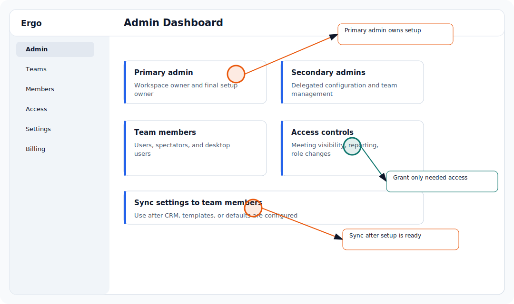

## Who is this for?

- For primary admins and secondary admins with permission for this area.
- Requires the primary admin role or a secondary admin permission that covers this area.

## Before you start

- Sign in as the primary admin or as a secondary admin with permission for this area.
- Confirm you are working in the intended organization or team.
- Review the change with the affected users before updating access or defaults.

## Configure it

- Open Admin and find the Spectator area or member list.
- Add, remove, or convert the spectator.
- Grant only the meeting or reporting access needed.
- Review access after team changes.

## Common issues

- The user is in the wrong workspace.
- The user has the wrong role or spectator status.
- The page requires meeting, reporting, shared-link, or admin-area access.
- The user needs to refresh after an access change.

## Related articles

- [Spectator access](../start-here/spectator-access)
- [Roles and permissions](../start-here/roles-and-permissions)
- [Permission or access denied](../troubleshooting/permission-or-access-denied)
