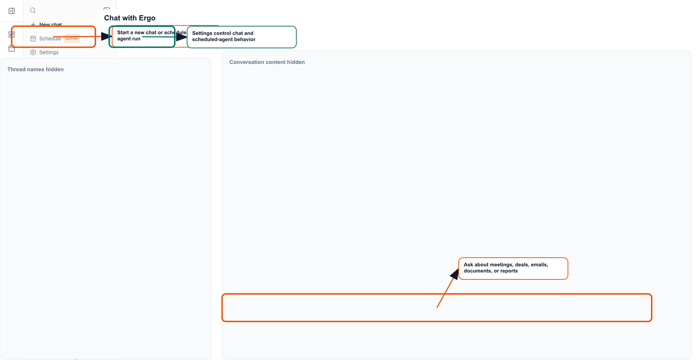

Sources explain where an answer came from. Actions are proposed changes or workflow steps. Review both before moving forward.

## Who can use this

- Anyone using Chat or the floating agent panel.
- Managers and admins reviewing whether an AI answer is grounded.

## Before you start

- Know which source type you expected: meeting, email, CRM, document, Slack, or web.
- Confirm the user has permission to see that source.
- Decide whether you need an answer only or an action.

## Steps

- Read the answer.
- Open or inspect cited sources when available.
- Check whether source snippets support the specific claim.
- Review any action card separately from the answer.
- Approve, edit, or dismiss actions according to your workflow.

## What to expect

- Sources can be incomplete when underlying systems are disconnected or still indexing.
- A source-backed answer can still need judgment if the source is stale.
- Action cards may require explicit user confirmation before applying changes.
- Some tool output is internal to the workflow and should not be copied into customer-facing messages without review.

## Common issues

- A user treats a summary as proof without checking the source.
- A proposed action is assumed to have executed.
- A source is missing because the record is outside the user's access.
- The answer combines multiple source types with different freshness.

## Related articles

- [Ergo AI, search, and automation](./index)
- [Chat with Ergo](./chat-with-ergo)
- [Using deal and meeting context](./using-deal-and-meeting-context)
- [Reviewing AI-generated outputs](../start-here/reviewing-ai-generated-outputs)
- [Security, data retention, and LLM usage](../start-here/security-data-retention-and-llm-usage)
