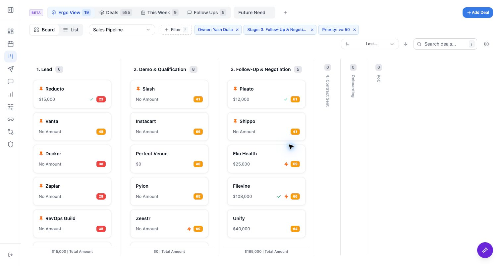

Use bulk actions only after you have confirmed the selected records, pipeline, and active filters. The bulk bar appears after you select one or more deals.

## Who can use this

- Sales reps, account owners, managers, RevOps, and admins working from pipeline and account context.

## Before you start

- Connect CRM and complete field mapping before relying on CRM writeback.
- Check pipeline, view, filter, ownership, and record matching before assuming a record is missing.
- Confirm Deals access is enabled for your workspace; contact your admin or Ergo support if you do not see it.

## Steps

- Select deals from kanban or list view.
- Move selected deals to another available stage in the current pipeline.
- Assign an owner, change close dates, or generate email drafts where available.
- Review the selected count and target action before confirming destructive or broad updates.

## What to expect

- Bulk stage and owner actions depend on pipeline scope, CRM permissions, and CRM-backed write behavior.
- Broad updates should be reviewed carefully; filtered views can make selection context easy to misread.
- Bulk-generated drafts are queued for review and should not be treated as sent.

## Common issues

- Selection includes records from the wrong filtered view.
- The target stage is disabled or not part of the selected pipeline.
- CRM permissions or field mapping prevent the update.

## Related articles

- [Deals and CRM](./index)
- [Activity, emails, meetings, and documents tabs](./activity-emails-meetings-and-documents-tabs)
- [Bulk email/Slack drafts](./bulk-email-slack-drafts)
- [Field mapping setup: required before CRM updates work](../field-mapping/field-mapping-setup-required-before-crm-updates-work)
- [CRM sync issues](../troubleshooting/crm-sync-issues)
