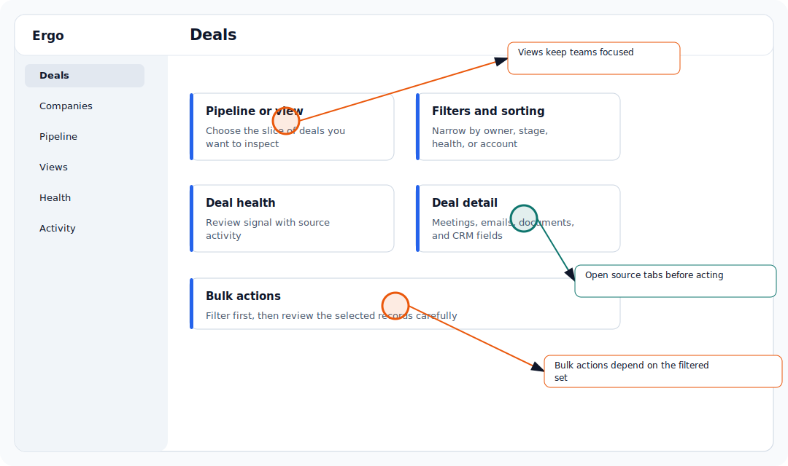

## Use this workflow

- Open the deal or company detail page.
- Review health indicators and the source activity behind them.
- Compare health with recent meetings, emails, and CRM updates.
- Use the signal as guidance, not a replacement for account judgment.

## Common issues

- The user is in the wrong workspace.
- A required integration is not connected.
- The user does not have the required role or access.
- The relevant meeting, deal, draft, report, or integration is still processing or syncing.

## Related articles

- [Deals and CRM](./index)
- [Troubleshooting](../troubleshooting/index)
- [Getting support](../start-here/getting-support)
