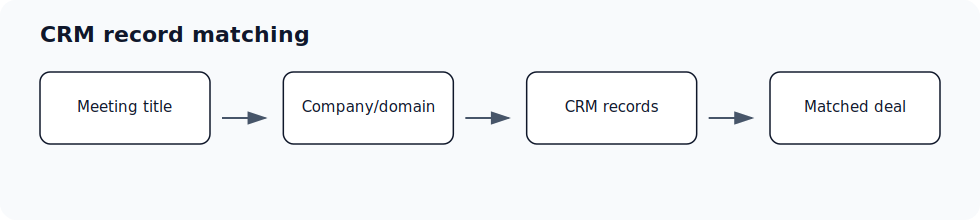

Use this page when a deal, company, meeting, email, or draft appears under the wrong account or is hard to find. Matching depends on CRM associations plus configured company and domain context; every spelling or alias may still need review.

## Who can use this

- Sales reps, account owners, managers, RevOps, and admins working from pipeline and account context.

## Before you start

- Connect CRM and complete field mapping before relying on CRM writeback.
- Check pipeline, view, filter, ownership, and record matching before assuming a record is missing.
- Confirm Deals access is enabled for your workspace; contact your admin or Ergo support if you do not see it.

## Steps

- Compare the CRM deal name, company name, contacts, email domains, and meeting title.
- Check company info, alternate domains/emails, and partnership domains when context is ambiguous.
- Confirm the selected pipeline and Companies view before changing names.
- Open the source CRM when two records may represent the same account.

## What to expect

- Ergo can show CRM-backed associations and related activity when those records have been ingested and matched.
- Alternate domains/emails broaden matching context; partnership domains help prevent partner activity from being treated as customer or prospect activity.
- Source CRM associations still matter. If a deal is not associated to the right contact or company, fix the source CRM association before relying on Ergo matching.

## Common issues

- The account uses multiple domains or aliases.
- A partner, reseller, or internal attendee is being treated like the customer.
- The CRM has duplicate companies or deals.

## Related articles

- [Deals and CRM](./index)
- [Add/edit deals](./add-edit-deals)
- [Company board](./company-board)
- [Field mapping setup: required before CRM updates work](../field-mapping/field-mapping-setup-required-before-crm-updates-work)
- [CRM sync issues](../troubleshooting/crm-sync-issues)
