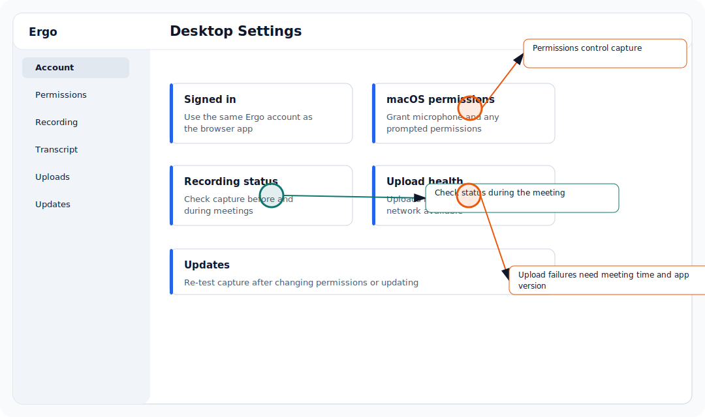

Use this page to install Ergo Desktop and sign in before relying on local recording.

## Who can use this

- Users with access to Ergo Desktop.
- Admins helping users verify the download and sign-in flow.

## Before you start

- Confirm your workspace has Desktop access enabled.
- Use the same email identity you use for the Ergo dashboard; the sign-in email must match the account provisioned for your workspace.
- Keep the app open until the browser sign-in callback returns to the desktop app.

## Steps

- Download Ergo Desktop from the approved Ergo download path.
- Open the app.
- Start sign-in from the desktop app.
- Complete the browser-based WorkOS sign-in.
- Return to the desktop app and confirm your email appears as the authenticated user.
- Open the dashboard and confirm you are using the same Ergo account.

## What to expect

- The backend download path is feature-gated for Desktop access.
- Desktop sign-in uses a browser auth flow and a desktop callback.
- The app stores the authenticated session locally and can refresh tokens.

## Common issues

- The download is unavailable because Desktop access is not enabled for the workspace.
- Sign-in fails because the email is not provisioned for the workspace or belongs to a different Ergo account.
- The browser callback opens but does not return to the desktop app.
- The desktop app is signed in as a different user than the dashboard.

## Related articles

- [Desktop](./index)
- [macOS permissions](./macos-permissions)
- [Desktop onboarding checklist](./desktop-onboarding-checklist)
- [Sign-in and desktop callback issues](../troubleshooting/sign-in-and-desktop-callback-issues)
