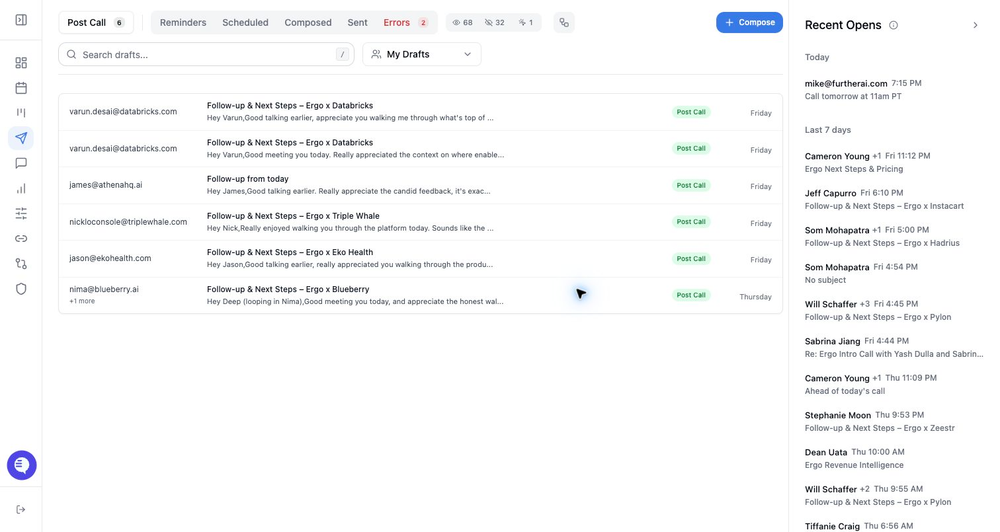

## Configure it

- Review auto-send settings with an admin.
- Confirm which workflows are eligible for auto-send.
- Test with low-risk workflows before expanding.
- Monitor failures and customer replies after enabling auto-send.

## Common issues

- Email grants expired or the mailbox was disconnected.
- The meeting source or meeting type did not qualify for draft generation.
- Another connected notetaker created duplicate context.
- A draft failed to sync or send and needs retry or report.

## Related articles

- [Drafts and email](./index)
- [Troubleshooting](../troubleshooting/index)
- [Getting support](../start-here/getting-support)
