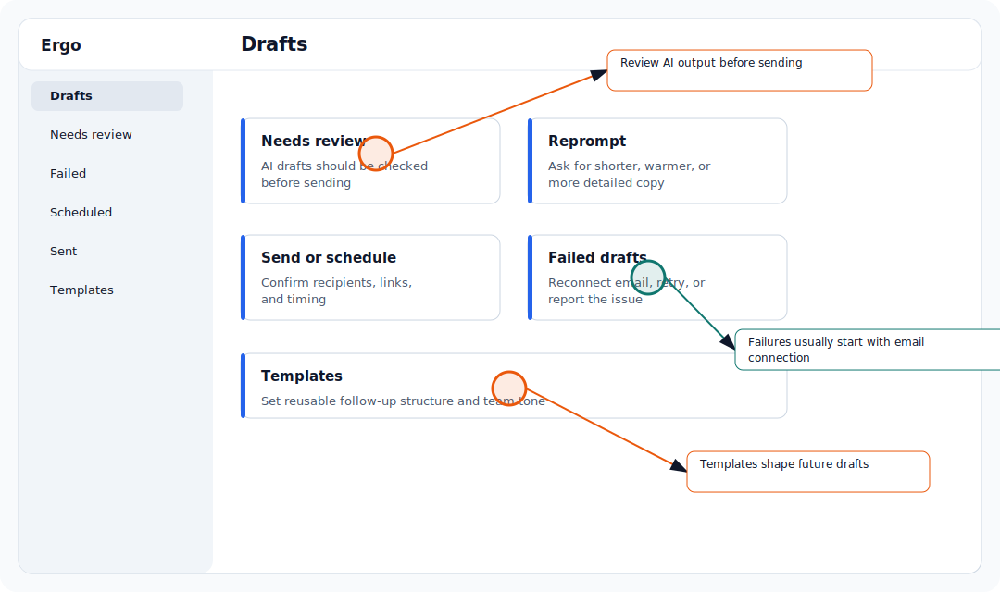

## Who is this for?

- For sales reps, account owners, founders, and managers reviewing or sending follow-up drafts.
- Requires Google Workspace or Microsoft 365.

## Before you start

- Confirm the relevant source is connected or available: Google Workspace or Microsoft 365.
- Make sure you are signed in to the correct Ergo workspace.
- If you do not see the page or setting, ask your primary admin or a secondary admin to check your access.

## Use this workflow

- Open Templates and choose create or edit.
- Write the template with reusable structure and variables.
- Preview output before saving.
- Test the template in a draft workflow.

## Common issues

- Email grants expired or the mailbox was disconnected.
- The meeting source or meeting type did not qualify for draft generation.
- Another connected notetaker created duplicate context.
- A draft failed to sync or send and needs retry or report.

## Related articles

- [Drafts and email](./index)
- [Troubleshooting](../troubleshooting/index)
- [Getting support](../start-here/getting-support)
