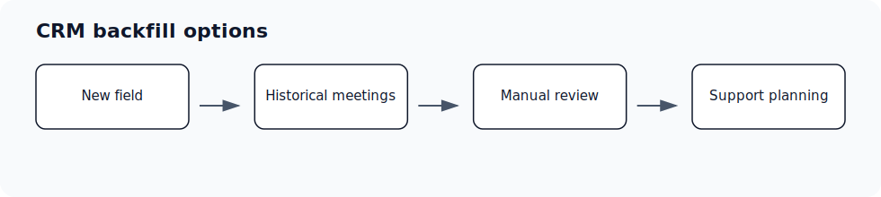

Use this page when a newly mapped field should be filled from historical meeting context. Backfill is not the same as normal forward-going CRM automation, and availability depends on source data, field type, source association, and implementation support.

## Who can use this

- RevOps, sales operations, CRM owners, and admins with CRM permissions.

## Before you start

- Use a CRM account that can read and update the fields Ergo needs.
- Map properties, pipelines, and stages before enabling broad CRM automation.
- Test changes on one record before rolling them out.

## Steps

- Decide which mapped fields need historical values.
- Confirm the source meetings exist, are visible, associated to the right records, and contain enough signal.
- Confirm the field type and write permission are compatible with backfill.
- Prefer a small historical sample before broad backfill.
- Document fields that should remain manual.

## What to expect

- Historical backfill may be limited or handled through project-specific operations rather than a universal self-serve button.
- Newly mapped fields do not automatically backfill every existing deal.
- Backfill does not reconstruct full CRM history. Historical emails, Slack activity, dates, stages, amounts, and closed-status fields may have additional limits or require separate review.
- Backfill output should be reviewed before broad CRM writeback.

## Common issues

- The field was mapped after the relevant meetings were processed.
- Historical meetings are missing, inaccessible, or not associated with the right record.
- The CRM field type is not safe for broad automated backfill.

## Related articles

- [Field mapping](./index)
- [Deal qualification](./deal-qualification)
- [CRM sync issues](../troubleshooting/crm-sync-issues)
- [Stage drift conflicts](../troubleshooting/stage-drift-conflicts)
