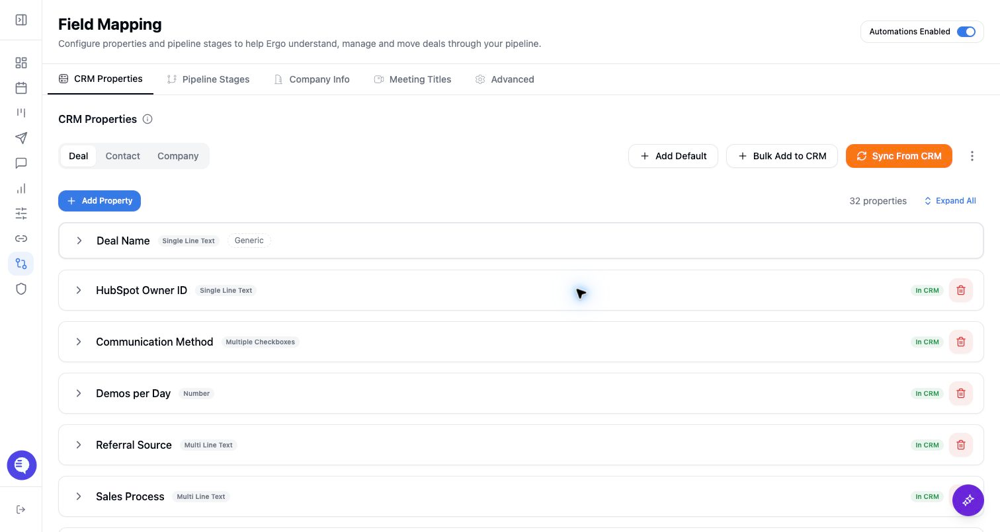

## Before you start

- Confirm CRM is connected or available.

## Configure it

- Create required properties in the CRM when they do not exist.
- Sync properties back into Ergo.
- Map the synced properties to the right Ergo fields.
- Test one record before relying on automated updates.

## Common issues

- The CRM property does not exist or has the wrong type.
- The connected CRM account cannot read or update the property.
- Pipeline or stage mappings changed in the CRM.
- Ergo is looking at a different deal or company record than expected.

## Related articles

- [Field mapping](./index)
- [Troubleshooting](../troubleshooting/index)
- [Getting support](../start-here/getting-support)
