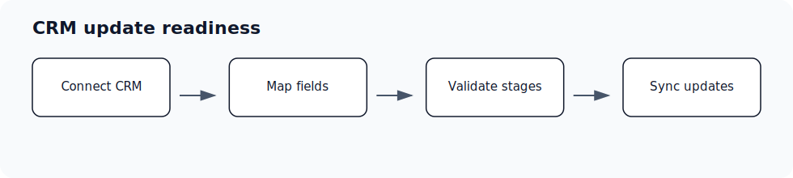

# Field Mapping overview

Audience: Admin; Super Admin; Spectator Admin · Access: Live · Requires: CRM

## Who can use this

Admin; Super Admin; Spectator Admin. If you do not see this workflow in Ergo, ask an admin to confirm your role, team, and access.

## Before you start

- Confirm the required source is connected or available: CRM.
- Make sure you are signed in to the correct Ergo workspace.
- If you do not see the page or setting, ask an admin to check your role and access.

## Steps

- Connect your CRM first.
- Review required properties, pipeline, stages, and permissions.
- Map Ergo fields to CRM fields before expecting updates.
- Resolve drift or permission issues before enabling broad automation.

## What to expect

- CRM updates depend on connection status, mapped properties, permissions, and pipeline/stage configuration.
- Schema or stage changes in the CRM can require remapping in Ergo.
- Test on a single record before rolling changes out broadly.

## Common issues

- The CRM property does not exist or has the wrong type.
- The connected CRM account cannot read or update the property.
- Pipeline or stage mappings changed in the CRM.
- Ergo is looking at a different deal or company record than expected.

## Related articles

- [Field mapping setup: required before CRM updates work](./field-mapping-setup-required-before-crm-updates-work)
- [CRM properties](./crm-properties)
- [Stage drift resolution](./stage-drift-resolution)
