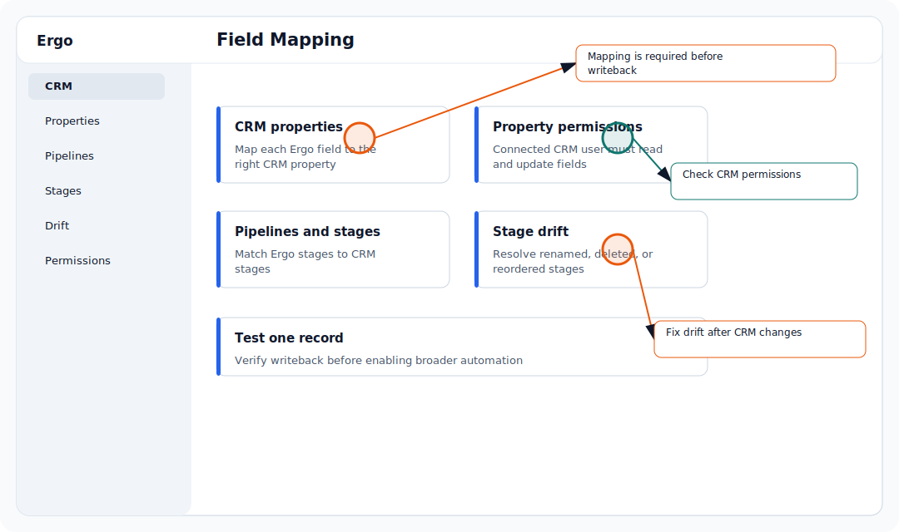

## Who is this for?

- For primary admins, secondary admins with CRM permissions, RevOps, sales operations, and CRM owners.
- Requires CRM.

## Before you start

- Confirm the required source is connected or available: CRM.
- Make sure you are signed in to the correct Ergo workspace.
- If you do not see the page or setting, ask your primary admin or a secondary admin to check your access.

## Configure it

- Review which controls are available for each stage.
- Set controls according to your team's process.
- Test stage movement on one deal.
- Adjust controls when CRM behavior changes.

## Common issues

- The CRM property does not exist or has the wrong type.
- The connected CRM account cannot read or update the property.
- Pipeline or stage mappings changed in the CRM.
- Ergo is looking at a different deal or company record than expected.

## Related articles

- [Field mapping](./index)
- [Troubleshooting](../troubleshooting/index)
- [Getting support](../start-here/getting-support)
