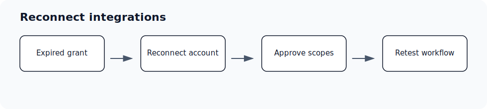

# Expired grants and reconnecting

Audience: User; Admin; Super Admin; Spectator · Access: Live · Requires: Any connected integration

## Who can use this

User; Admin; Super Admin; Spectator. If you do not see this workflow in Ergo, ask an admin to confirm your role, team, and access.

## Before you start

- Confirm the required source is connected or available: Any connected integration.
- Make sure you are signed in to the correct Ergo workspace.
- If you do not see the page or setting, ask an admin to check your role and access.

## Steps

- Open Integrations and find the disconnected or expired integration.
- Reconnect with the same account when possible.
- Approve every required scope during the reconnect flow.
- Re-test the workflow that was blocked, such as meeting detection, draft sync, or Slack delivery.

## What to expect

- Ergo should reflect the update after the relevant integration, permission, or processing step completes.
- If the expected page or control is missing, check role and integration access.
- Use support when setup looks correct but the workflow still does not work.

## Common issues

- The integration grant expired or was revoked.
- The reconnect was completed with a different account than expected.
- Required scopes were not approved.
- The connected service changed permissions or channel/calendar access.

## Related articles

- [Google/Microsoft/Slack reconnects](../troubleshooting/google-microsoft-slack-reconnects)
- [Connect email and calendar](../setup/connect-email-and-calendar)
- [Slack](./slack)
