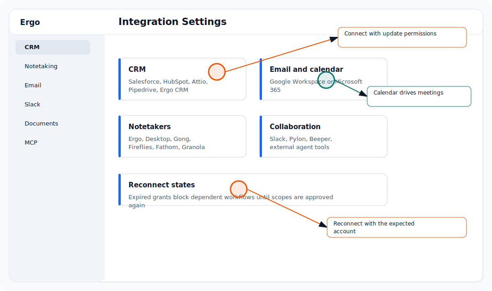

## Before you start

- Have access to the Google Workspace account or admin console you plan to connect.
- Use the account your team expects Ergo to read from or write through.

## Setup steps

- Connect Google Workspace from setup or Integrations.
- Approve calendar and email scopes.
- Confirm customer meetings are on the connected calendar.
- Reconnect Google Workspace if Ergo stops seeing meetings or drafts cannot sync.

## Common issues

- The integration grant expired or was revoked.
- The reconnect was completed with a different account than expected.
- Required scopes were not approved.
- The connected service changed permissions or channel/calendar access.

## Related articles

- [Connect email and calendar](../setup/connect-email-and-calendar)
- [Calendar scopes and meeting auto-join](./calendar-scopes-and-meeting-auto-join)
- [Expired grants and reconnecting](./expired-grants-and-reconnecting)
