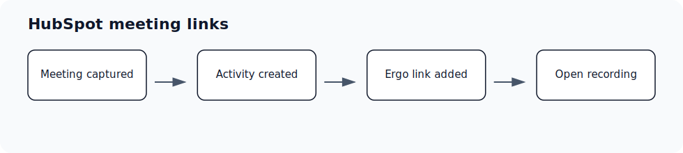

## Before you start

- Have access to the HubSpot, Notetaker or Granola account or admin console you plan to connect.
- Use the account your team expects Ergo to read from or write through.

## Setup steps

- Open the HubSpot company, contact, or deal associated with the meeting.
- Look for the meeting activity created or updated by Ergo.
- Use the View Meeting in Ergo link when it appears in the activity.
- Remember that audio availability depends on the meeting source; some external notetakers may not provide audio to Ergo.

## Common issues

- The company or deal name differs from the meeting or customer name.
- The meeting is associated with a different CRM record than expected.
- Domain, contact, or account data is incomplete in the CRM.
- The meeting source does not provide the same recording or audio assets as Ergo Notetaker.

## Related articles

- [Integrations](./index)
- [Troubleshooting](../troubleshooting/index)
- [Getting support](../start-here/getting-support)
