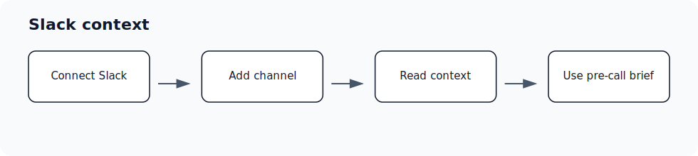

## Who is this for?

- For primary admins, secondary admins, RevOps, support operations, and sales operations teams that manage connected systems.
- Requires Slack.

## Before you start

- Sign in to the correct Ergo workspace.
- Have access to the Slack account or admin console you plan to connect.
- Use the account your team expects Ergo to read from or write through.
- If you are reconnecting, use the same account when possible and approve every requested scope.

## Setup steps

- Connect Slack and confirm Ergo has access to the customer channels that matter.
- Add Ergo to new customer channels before expecting pre-call context from those channels.
- Check whether Slack Connect or private-channel permissions affect visibility.
- Review duplicate or missing pre-call context with support when channel setup looks correct.

## Common issues

- Slack is disconnected or was reconnected with the wrong workspace.
- Ergo is not in the customer channel.
- Private, shared, or Enterprise Grid channel permissions block visibility.
- Old channel mappings are still affecting context or delivery.

## Related articles

- [Integrations](./index)
- [Troubleshooting](../troubleshooting/index)
- [Getting support](../start-here/getting-support)
