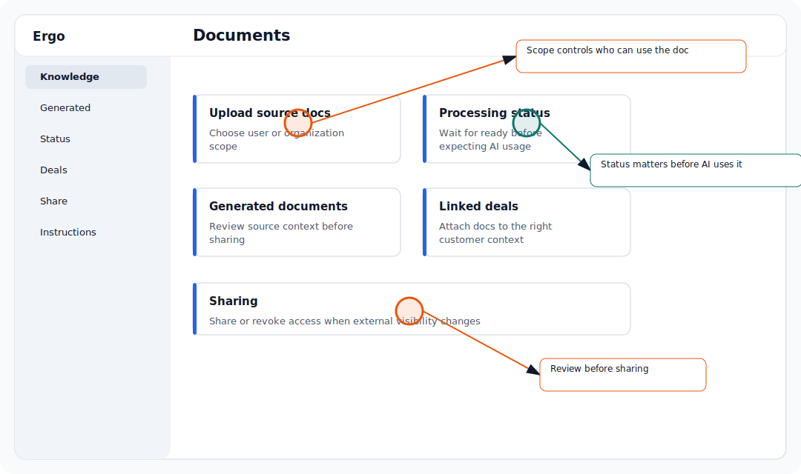

## Use this workflow

- Open post-call instructions.
- Write clear instructions for how Ergo should summarize, draft, or update context.
- Test instructions on one meeting.
- Adjust when outputs repeat the wrong emphasis.

## Common issues

- The user is in the wrong workspace.
- A required integration is not connected.
- The user does not have the required role or access.
- The relevant meeting, deal, draft, report, or integration is still processing or syncing.

## Related articles

- [Knowledge base and documents](./index)
- [Troubleshooting](../troubleshooting/index)
- [Getting support](../start-here/getting-support)
