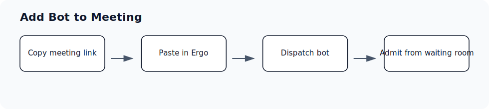

## Before you start

- Have the live meeting link available.
- Make sure the meeting host can admit the Ergo bot if there is a waiting room.

## Use this workflow

- Copy the Zoom, Google Meet, or Microsoft Teams link.
- Open Add Bot to Meeting from the meetings area.
- Paste the meeting link and dispatch Ergo.
- Confirm the bot appears in the meeting and admit it if there is a waiting room.

## Common issues

- The bot was not admitted from the waiting room.
- The meeting was rescheduled or moved to a different link.
- The meeting was on a calendar Ergo cannot access.
- A recording is available but transcript, insights, or drafts are still missing.

## Related articles

- [Schedule or cancel the notetaker](./schedule-or-cancel-the-notetaker)
- [Notetaker waiting-room admission guide](./notetaker-waiting-room-admission-guide)
- [Notetaker did not join](../troubleshooting/notetaker-did-not-join)
