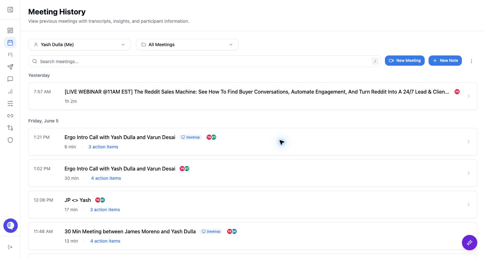

## Use this workflow

- Confirm the meeting is on a connected calendar.
- Check whether the viewer has access to the meeting, folder, or shared link.
- Ask an admin to review global meeting access when a team member needs broader visibility.
- Use support if the meeting exists but the expected viewer cannot access it.

## Common issues

- The bot was not admitted from the waiting room.
- The meeting was rescheduled or moved to a different link.
- The meeting was on a calendar Ergo cannot access.
- A recording is available but transcript, insights, or drafts are still missing.

## Related articles

- [Global meeting access](../admin/global-meeting-access)
- [Permission or access denied](../troubleshooting/permission-or-access-denied)
- [Transcript or recording missing](../troubleshooting/transcript-or-recording-missing)
