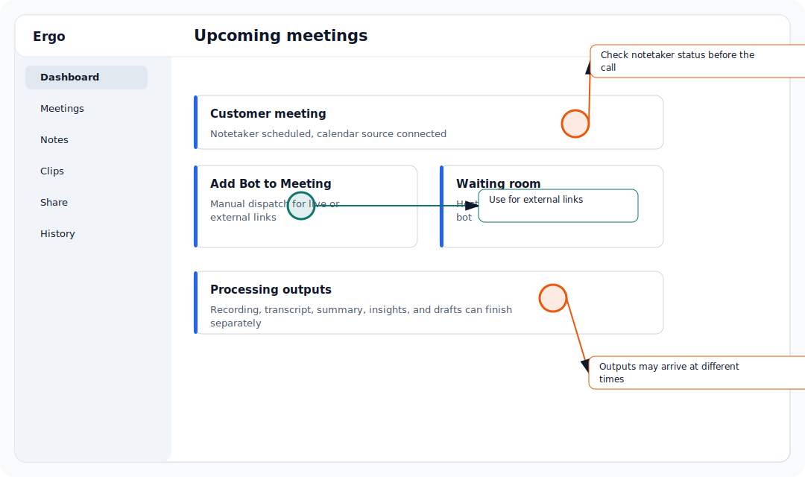

## Who is this for?

- For sales reps, account owners, CSMs, founders, and managers who capture or review customer meetings; admins setting meeting capture and visibility defaults; spectators viewing shared meetings.
- Requires Ergo Notetaker.

## Before you start

- Confirm the required source is connected or available: Ergo Notetaker.
- Make sure you are signed in to the correct Ergo workspace.
- If you do not see the page or setting, ask your primary admin or a secondary admin to check your access.

## Use this workflow

- Open the upcoming meeting in Ergo.
- Schedule the notetaker if Ergo should join.
- Cancel the notetaker if Ergo should not join.
- For meetings that changed time or link, verify the meeting again after the calendar update syncs.

## Common issues

- The bot was not admitted from the waiting room.
- The meeting was rescheduled or moved to a different link.
- The meeting was on a calendar Ergo cannot access.
- A recording is available but transcript, insights, or drafts are still missing.

## Related articles

- [Ergo Notetaker](../integrations/ergo-notetaker)
- [Add Bot to Meeting for external links](./add-bot-to-meeting-for-external-links)
- [What happens when a meeting is rescheduled](./what-happens-when-a-meeting-is-rescheduled)
