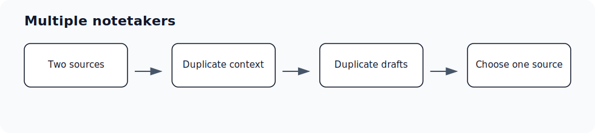

## Use this workflow

- Decide which notetaker source should drive Ergo automations.
- Avoid connecting multiple notetakers to the same workflow when possible.
- If you keep another notetaker for internal use, disconnect it from Ergo when duplicate drafts appear.
- Use Ergo Desktop or Ergo Notetaker as the connected source when you want Ergo outputs and automations.

## Common issues

- More than one notetaker source captured the same meeting.
- An external notetaker is connected to Ergo while Ergo Notetaker or Desktop is also active.
- Draft deduplication does not apply across every notetaker source.
- The team wants to keep an external notetaker for internal use but not for Ergo automations.

## Related articles

- [Meetings and notetaker](./index)
- [Troubleshooting](../troubleshooting/index)
- [Getting support](../start-here/getting-support)
