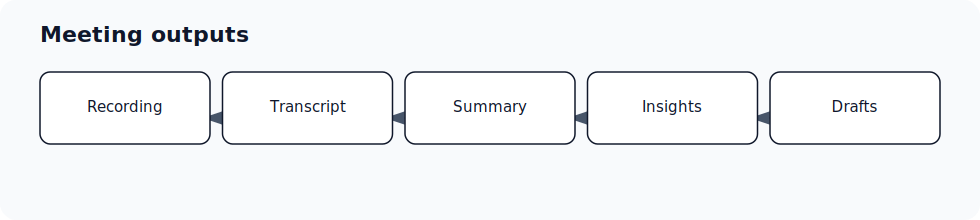

A completed recording does not mean every downstream output will be created.

## Common reasons

- The meeting has no transcript or an unusable transcript.
- The meeting was treated as internal or not relevant for the configured sales workflow.
- The meeting source does not trigger the same automations as scheduled notetaker meetings.
- CRM, email, or template settings are not connected or configured for the user.
- The meeting has duplicate capture sources, and outputs were generated from a different record.

## What to check first

- Recording and transcript availability.
- Meeting source: Ergo bot, desktop recording, manual note, external recording, or another integration.
- Whether the meeting is linked to the right deal or attendees.
- Whether post-call drafting and CRM update settings are enabled.
- Whether the meeting is still processing.

## What to do

- If the transcript is missing, start with recording/transcript troubleshooting.
- If the transcript exists but downstream outputs are missing, check meeting filters and automation eligibility. A filtered meeting can still have a summary or transcript while CRM updates, sales insights, or post-call drafts are suppressed.
- If the UI exposes a push or retry action, use it once after confirming the meeting has the required context.

## Related articles

- [Meeting filter: what sales-only processing means](./meeting-filter-what-sales-only-processing-means)
- [Push notes or meetings to automations](./push-notes-or-meetings-to-automations)
- [Using multiple notetakers with Ergo](./using-multiple-notetakers-with-ergo)
- [Failed drafts retry report](../drafts-email/failed-drafts-retry-report)
