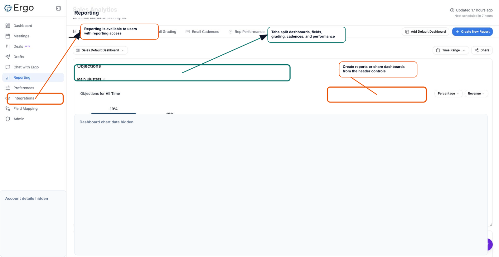

Reports in Ergo are chart widgets saved to a Reporting dashboard. Create them from Chart Builder, then save them to the dashboard where the team will review them.

## Who can use this

- Users with Reporting create access can create and edit reports.
- Users with view-only Reporting access can review dashboards they have access to, but may not see creation controls.

## Create a report

1. Open **Reporting**.
2. Select **Create New Report**.
3. Rename the report title if needed.
4. Choose a main category.
5. Optionally choose a breakdown category, filters, time range, chart type, or supported advanced view.
6. Review the preview.
7. Select **Save Report**.
8. Choose the dashboard where the report should appear.

## Edit an existing report

1. Open the dashboard that contains the chart widget.
2. Open the widget menu.
3. Select the edit action.
4. Update the category, breakdown, filters, chart type, time range, revenue preset, or rubric field as needed.
5. Select **Update Report**.

## What to expect

- A main category is required before a report can be saved.
- Saved chart types are bar or pie.
- Editing a report updates the widget configuration on the selected dashboard.
- Some category combinations are blocked: rubric and deal/company-level fields do not support the same breakdown behavior as correspondence-level fields.
- If a dashboard is missing from the save modal, check Reporting access and dashboard permissions.

## Related articles

- [Reporting](./index)
- [Default dashboards](./default-dashboards)
- [Chart builder](./chart-builder)
- [Save widgets to dashboards](./save-widgets-to-dashboards)
- [Search/reporting has no results](../troubleshooting/search-reporting-has-no-results)
