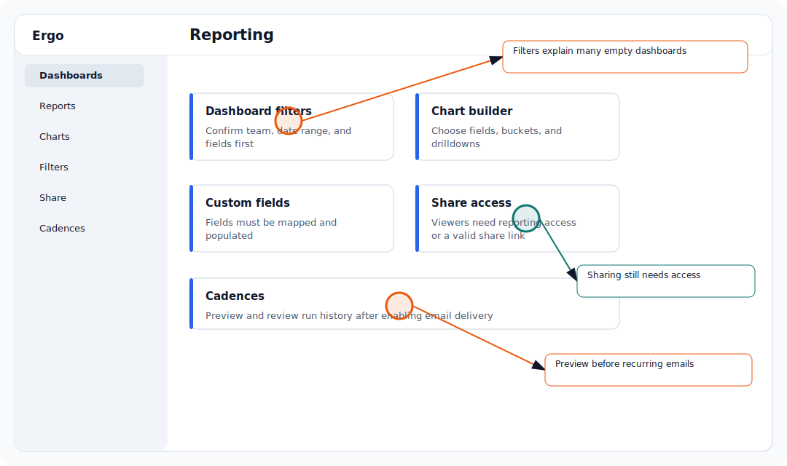

## Use this workflow

- Open the default dashboard.
- Review the widgets and filters included.
- Use it as a baseline before creating custom dashboards.
- Ask an admin if the dashboard does not appear.

## Common issues

- The viewer does not have reporting access.
- Filters or time ranges exclude the expected data.
- Meetings, CRM fields, or reporting fields are still syncing.
- A shared link or embedded dashboard does not include the expected permissions.

## Related articles

- [Reporting](./index)
- [Troubleshooting](../troubleshooting/index)
- [Getting support](../start-here/getting-support)
