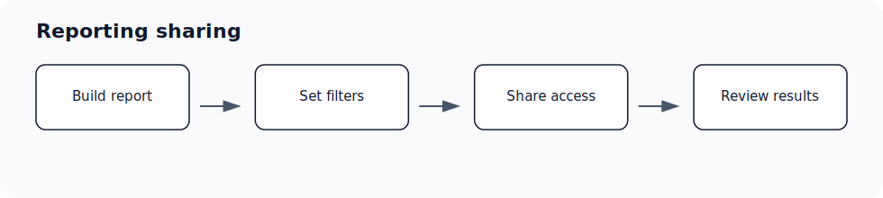

# Reporting dashboard sharing and embedding troubleshooting

Audience: User; Admin; Super Admin · Access: Shared link; Reporting access · Requires: Reporting

## Symptoms

Use this article when this issue is blocking setup, meetings, CRM updates, drafts, access, or reporting in Ergo.

## Most common causes

- The viewer does not have reporting access.
- Filters or time ranges exclude the expected data.
- Underlying meetings, CRM fields, or reports have not synced yet.
- A shared link or embedded dashboard does not include the expected permissions.

## What to check

- Check whether the dashboard has sharing enabled.
- Confirm the viewer has reporting access or the correct shared link.
- Review filters and embed settings if results look empty.
- Contact support when permissions look correct but the shared view fails.

## Resolution steps

1. Confirm the affected workspace, user, meeting, deal, draft, report, or integration.
2. Check the related setup article before retrying the workflow.
3. Reconnect required integrations or update access when those checks identify the cause.
4. Retry the workflow from Ergo.
5. Contact support if the issue persists after the checks above.

## When to contact support

- You cannot see the page or control after an admin confirms access.
- A connected integration appears healthy but the workflow still does not complete.
- A customer-facing output is incorrect and cannot be corrected from the page.

## Related articles

- [Reporting](./index)
- [Troubleshooting](../troubleshooting/index)
- [Getting support](../start-here/getting-support)
