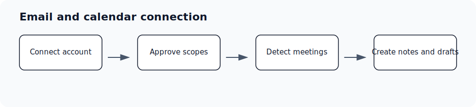

## Who is this for?

- For users connecting their own email/calendar and admins helping teams finish setup or reconnect expired grants.
- Requires Google Workspace or Microsoft 365.

## Before you start

- Sign in to the correct Ergo workspace.
- Have access to the Google Workspace or Microsoft 365 account or admin console you plan to connect.
- Use the account your team expects Ergo to read from or write through.
- If you are reconnecting, use the same account when possible and approve every requested scope.

## Setup steps

- Choose Google Workspace or Microsoft 365.
- Grant the requested email and calendar scopes.
- Confirm Ergo can see the calendar that contains customer meetings.
- Reconnect if Ergo shows an expired grant or meetings stop appearing.

## Common issues

- The person is in the wrong workspace.
- Their role or permission does not match the setup path.
- A required integration is not connected yet.
- A setup step is hidden until earlier setup is complete or enabled for the workspace.

## Related articles

- [Google Workspace](../integrations/google-workspace)
- [Microsoft 365](../integrations/microsoft-365)
- [Calendar scopes and meeting auto-join](../integrations/calendar-scopes-and-meeting-auto-join)
