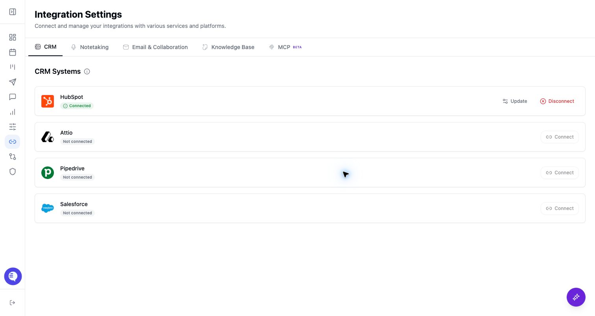

Use this page when an admin or CRM owner is connecting the workspace CRM before enabling CRM-based deal views, field mapping, reporting, AI context, or writeback. Connecting the CRM is the first step; Field Mapping and a controlled test record are what make downstream CRM updates ready for rollout.

## Who can use this

- Admins, RevOps owners, operators, and CRM owners who manage workspace setup.
- Standard users only when your team has delegated CRM setup to them.
- Spectator users should not complete CRM setup. CRM write actions are blocked for spectators.

## Before you start

- Choose the CRM that should be the source of truth: Salesforce, HubSpot, Attio, Pipedrive, or Ergo CRM.
- Use a CRM account that can access the objects, fields, pipelines, stages, and owners Ergo needs for your rollout.
- Decide whether Ergo should start as read-only context or whether the rollout will also allow CRM create/update actions after mapping is verified.
- Identify fields that other systems own, such as routing, enrichment, billing, or implementation fields, so they are not accidentally treated as fields Ergo should update.
- If you use Ergo CRM, treat contacts, companies, and deals as living in Ergo. External-CRM sync, drift, and owner-ID checks apply to connected external CRMs.

## Connect the source

1. Sign in as the admin or CRM owner who should authorize the connection.
2. Open **Integrations**.
3. Select the CRM your workspace will use.
4. Follow the connection method shown in Ergo. Salesforce, HubSpot, and Attio use OAuth-style authorization paths in the app; Pipedrive uses an API-key path; Ergo CRM connects without an external key.
5. Confirm the CRM shows as connected before moving to Field Mapping.
6. If the connection fails or later becomes stale, reconnect from **Integrations** before changing mappings.

## Map the CRM before rollout

After the CRM is connected, open **Field Mapping** and configure the CRM data Ergo can use.

1. Sync CRM properties for deals, contacts, and companies.
2. Review property names, internal IDs, field types, options, multi-select behavior, and descriptions.
3. Sync owner ID properties when the connected CRM requires them.
4. Sync pipelines and stages from the CRM.
5. Review stage descriptions and transition guardrails so stage movement follows your team's process.
6. Set property permissions for deal, contact, and company create/update actions.
7. Resolve property or stage drift if the CRM schema changed after setup.
8. Test one controlled deal, contact, company, or meeting workflow before inviting the broader team to rely on automation.

## What to expect

- A connected CRM does not automatically mean CRM updates are ready. Properties, permissions, pipelines, stages, and owners still need setup.
- Ergo can read CRM context only from sources the connected account can access.
- CRM create/update behavior is constrained by the connected CRM, Field Mapping, property permissions, user access, feature access, and the workflow that triggered the action.
- CRM-side field, stage, or pipeline changes can create drift. Re-sync or resolve drift before relying on broad writeback.
- Deals, reporting, drafts, search, and account context can depend on record matching, source freshness, filters, and feature access.
- For HubSpot, meeting activity and recording-link behavior is covered separately because it depends on HubSpot-specific setup and permissions.

## Common issues

- The CRM shows connected, but Field Mapping is incomplete.
- The connected CRM account cannot read or update the needed fields, owners, pipelines, or stages.
- A CRM field, option, pipeline, or stage changed after setup and needs sync or drift resolution.
- Owner fields are missing, especially after user or CRM-owner changes.
- Property permissions allow reading context but block create or update actions.
- The wrong production, sandbox, or test CRM account was connected.
- A deal or company appears missing because the selected pipeline, saved view, filter, owner, or record match is different than expected.
- A viewer expects CRM writeback, but they are a spectator or otherwise lack the required role, permission, or feature access.

## Related articles

- [Field Mapping overview](../field-mapping/field-mapping-overview)
- [Field mapping setup: required before CRM updates work](../field-mapping/field-mapping-setup-required-before-crm-updates-work)
- [CRM properties](../field-mapping/crm-properties)
- [Property permissions](../field-mapping/property-permissions)
- [Pipelines](../field-mapping/pipelines)
- [Stage drift resolution](../field-mapping/stage-drift-resolution)
- [Salesforce](../integrations/salesforce)
- [HubSpot](../integrations/hubspot)
- [Attio](../integrations/attio)
- [Pipedrive](../integrations/pipedrive)
- [Ergo CRM](../integrations/ergo-crm)
- [HubSpot meeting activities and recording links](../integrations/hubspot-meeting-activities-and-recording-links)
- [How Ergo names and matches CRM records](../deals-crm/how-ergo-names-and-matches-crm-records)
- [CRM sync issues](../troubleshooting/crm-sync-issues)
