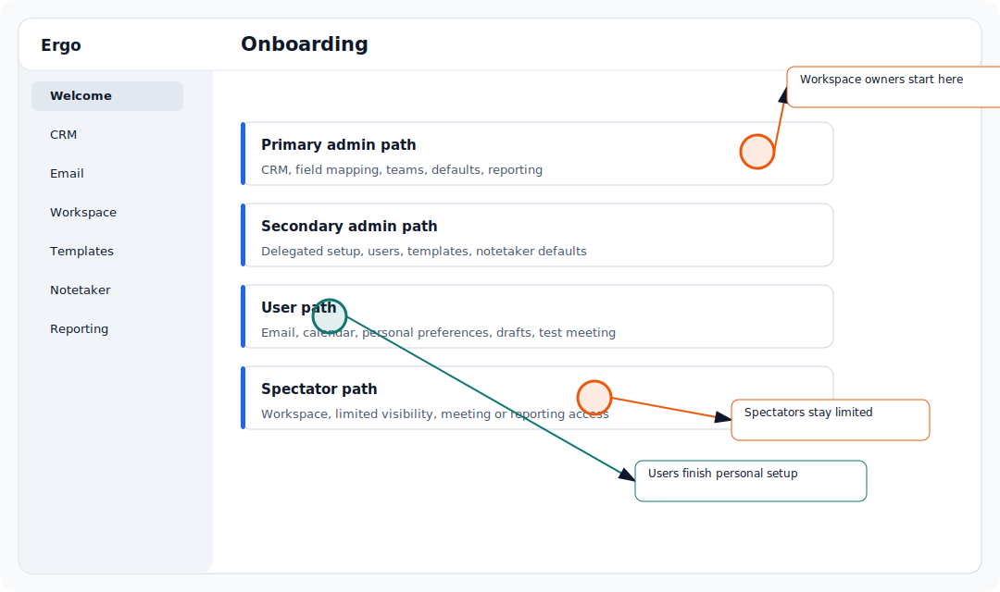

## Who is this for?

- For primary admins who own rollout, secondary admins helping with delegated setup, users completing personal setup, and spectators receiving limited access.

## Before you start

- Sign in to Ergo.
- Confirm you are in the correct workspace.
- If a step is missing, ask your primary admin or a secondary admin to confirm your access.

## Setup steps

- Primary admins should connect CRM, configure field mapping, create or review teams, set company details, meeting-title phrases, pipeline stages, pricing, advanced settings, and reporting defaults.
- Secondary admins should complete any delegated setup they own, such as user sync, team settings, templates, collaboration tools, notetaker defaults, reporting access, or helping users finish setup.
- Users should connect email/calendar, review personal workspace settings, set template preferences, confirm notetaker behavior, and learn the daily workflows they will use.
- Spectators should confirm their workspace, view-only access, and any meeting or reporting links they are expected to review.
- RevOps, founders, and sales leaders should verify that the role split matches how the team actually operates before inviting the broader org.

## Common issues

- The person is in the wrong workspace.
- Their role or permission does not match the setup path.
- A required integration is not connected yet.
- A setup step is hidden until earlier setup is complete or enabled for the workspace.

## Related articles

- [First-time setup checklist](./first-time-setup-checklist)
- [Roles and permissions](../start-here/roles-and-permissions)
- [Connect your CRM](./connect-your-crm)
