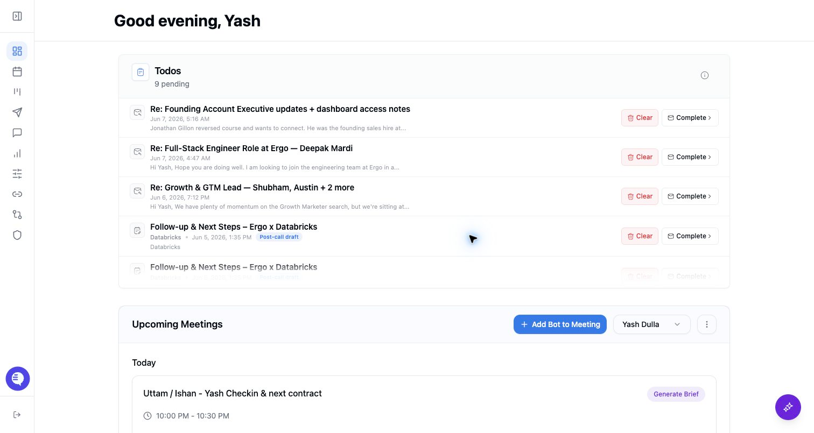

Use this page to find the main areas of Ergo and confirm which routes your role can access.

## Who can use this

- Everyone using Ergo, plus rollout owners and admins who need shared vocabulary.

## Before you start

- Know which CRM, calendar, email, meeting, and collaboration sources your organization has connected to Ergo.
- Confirm whether you are a user, admin, super admin, or spectator.
- Ask your rollout owner before changing access, recording, integration defaults, or admin-only setup areas. A rollout owner is the person responsible for coordinating your team's Ergo setup; it is not a separate product role.

## Steps

- Use **Meetings** for captured calls, transcripts, summaries, clips, and sharing.
- Use **Drafts** for AI-generated email drafts, sent email tracking, scheduling, and retries. Spectators do not see this area.
- Use **Deals** for CRM-backed account and opportunity context when your team has enabled the Deals workspace.
- Use **Chat with Ergo**, **Search**, **Reporting**, and **Follow-ups** only when those surfaces are enabled for your organization or granted to your role.
- Use **Integrations**, **Field Mapping**, and **Admin** for setup and access. Treat Field Mapping as an admin/setup area, not a day-to-day workflow for every user.

## What to expect

- The app hides surfaces that do not apply to your role, enabled product areas, or connected-source access.
- Desktop users can also see desktop-only settings and manual-note behavior.

## Common issues

- The wrong source, account, or organization context is selected.
- The needed source is not connected or fresh.
- A role or shared-link expectation is too broad.

## Related articles

- [Start here](./index)
- [Welcome to Ergo](./welcome-to-ergo)
- [Roles and permissions](./roles-and-permissions)
- [First-time setup checklist](../setup/first-time-setup-checklist)
- [Permission or access denied](../troubleshooting/permission-or-access-denied)
