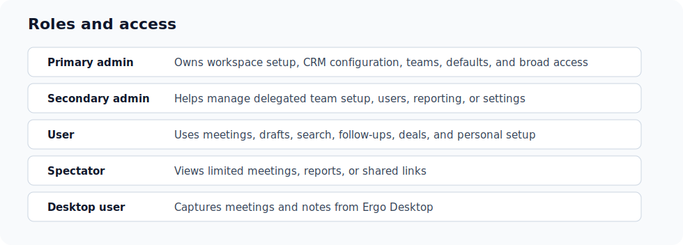

# Roles and permissions

Audience: User; Admin; Super Admin; Spectator · Access: Live

## Who can use this

User; Admin; Super Admin; Spectator. If you do not see this workflow in Ergo, ask an admin to confirm your role, team, and access.

## Before you start

- Sign in to Ergo.
- Confirm you are in the correct workspace.
- If a step is missing, ask an admin to confirm your access.

## Steps

- Identify the person as a User, Admin, Super Admin, Spectator, or Desktop user.
- Check whether the workflow needs admin-only access, reporting access, shared-link access, or desktop access.
- Update the role from Admin when the person needs broader permissions.
- Use spectator access for limited viewing workflows instead of granting full user access.

## What to expect

- Ergo should reflect the update after the relevant integration, permission, or processing step completes.
- If the expected page or control is missing, check role and integration access.
- Use support when setup looks correct but the workflow still does not work.

## Common issues

- The user is in the wrong workspace.
- A required integration is not connected.
- The user does not have the required role or access.
- The underlying meeting, deal, draft, or report is still processing.

## Related articles

- [Spectator access](./spectator-access)
- [Promote/demote/convert roles](../admin/promote-demote-convert-roles)
- [Permission or access denied](../troubleshooting/permission-or-access-denied)
