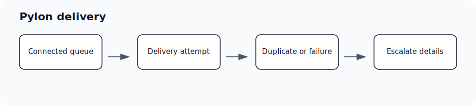

# Pylon delivery failures, duplicate deliveries, and queue health

Audience: Admin; Super Admin · Access: Live · Requires: Pylon

## Symptoms

Use this article when this issue is blocking setup, meetings, CRM updates, drafts, access, or reporting in Ergo.

## Most common causes

- Pylon is disconnected or connected to the wrong workspace.
- The affected queue, issue, or account is not visible to Ergo.
- A delivery retried and appeared more than once.
- The workflow failed after Ergo generated the payload.

## What to check

- Confirm Pylon is connected.
- Check whether the affected issue, queue, or workflow is visible to Ergo.
- Review whether duplicate deliveries are one-time, repeated, or tied to a specific workflow.
- Contact support with the Pylon issue, workspace, and delivery time if duplicates or failures persist.

## Resolution steps

1. Confirm the affected workspace, user, meeting, deal, draft, report, or integration.
2. Check the related setup article before retrying the workflow.
3. Reconnect required integrations or update access when those checks identify the cause.
4. Retry the workflow from Ergo.
5. Contact support if the issue persists after the checks above.

## When to contact support

- The workflow still fails after checking setup and reconnecting required integrations.
- A meeting, draft, or CRM update is missing after the expected processing window.
- The customer-facing error message does not explain what to fix next.

## Related articles

- [Troubleshooting](./index)
- [Getting support](../start-here/getting-support)
