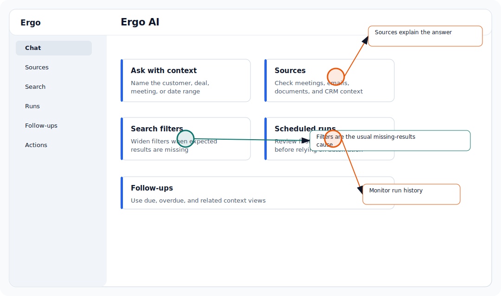

## Who is this for?

- For primary admins, secondary admins, RevOps, sales leaders, and operators who manage rollout; users who complete setup or use this workflow day to day.
- Requires reporting access.
- Requires Search sources, Reporting.
- Ask your Ergo team if the feature does not appear.

## Symptoms

Use this article when this issue is blocking setup, meetings, CRM updates, drafts, access, or reporting in Ergo.

## Most common causes

- The viewer does not have reporting access.
- Filters or time ranges exclude the expected data.
- Meetings, CRM fields, or reporting fields are still syncing.
- A shared link or embedded dashboard does not include the expected permissions.

## What to check

- Check filters, date range, and selected source.
- Confirm the underlying meetings, emails, documents, or reporting fields exist.
- Wait for processing or sync if data was just added.
- Contact support if known data still does not appear.

## Resolution steps

1. Confirm the affected workspace, user, meeting, deal, draft, report, or integration.
2. Check the related setup article before retrying the workflow.
3. Reconnect required integrations or update access when those checks identify the cause.
4. Retry the workflow from Ergo.
5. Contact support if the issue persists after the checks above.

## When to contact support

- The workflow still fails after checking setup and reconnecting required integrations.
- A meeting, draft, or CRM update is missing after the expected processing window.
- The customer-facing error message does not explain what to fix next.

## Related articles

- [Troubleshooting](./index)
- [Getting support](../start-here/getting-support)
